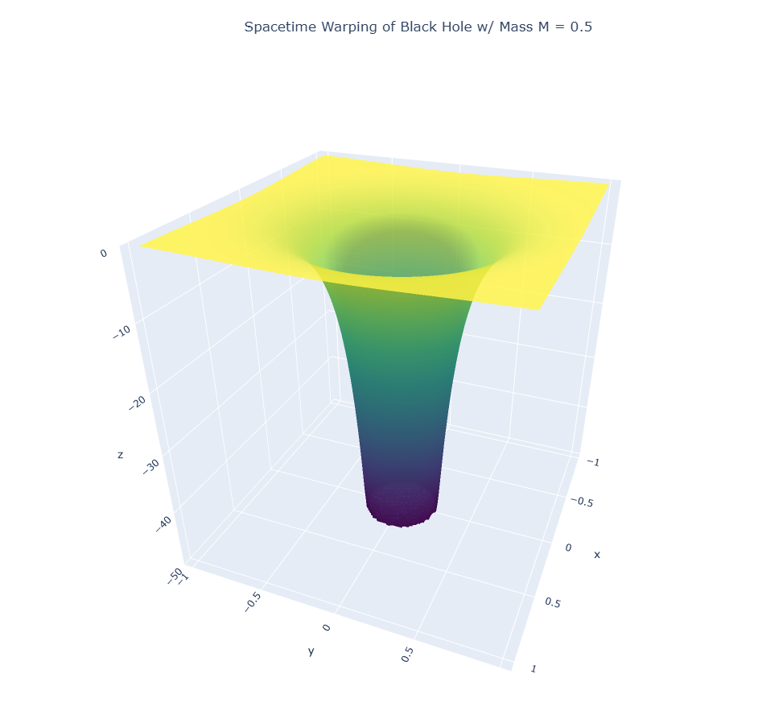

## General-Relativity-on-Black-Holes

The General Relativity black hole model is used to analyze the behavior of particles around a black hole, in both a astrophysics and quantum scale. The program uses a Taichi lang backend and the Python plotting library plotly in order to simulate the black hole and it's gravitational pull towards the particles near it, resulting in an accretion disk. Fundamentally, this involves how gravity is transferred in space, otherwise known as general relativity, in order to induce this gravitational pull towards the particles near the entity. Therefore, this simulation aims to give a scientifically accurate way of analyzing general relativity and it's applications through showing the movement of particles near a black hole.

## Program Configurations and Concepts

In order to provide a scientifically accurate program, the repository is based off of a detailed roadmap for the project, consisting of critical concepts and formulas that are needed in the MHD black hole simulation. The configurations and concepts used for the project is linked here: [General Relativity Black Hole Project Concepts and Configurations](https://drive.google.com/file/d/1h41U-CFilZ9jexLTXPLW_PiRI_22rOOk/view?usp=sharing). **This PDF is still being updated with more content in future commits.**

## Acknowledgements:
I thank the EinsteinPy Python library for providing detailed visualizations of General Relativity for analysis, as well as assistance with the Christoffel symbols used in the thought process of the simulation.

- The EinsteinPy Project: https://github.com/einsteinpy/einsteinpy

I also sincerely thank the Taichi Lang library for the backend integration with the numerical computations used in this program.

- Taichi Lang Research Paper: https://yuanming.taichi.graphics/publication/2019-taichi/taichi-lang.pdf
- Taichi Lang Repository: https://github.com/taichi-dev/taichi

The plotly library was instrumental to making many features for this simulation as well.

- plotly library: https://github.com/plotly/plotly.py

## Contact Information:
For questions and concerns regarding this repository, please email Om Kasar at contact.omkasar@gmail.com.